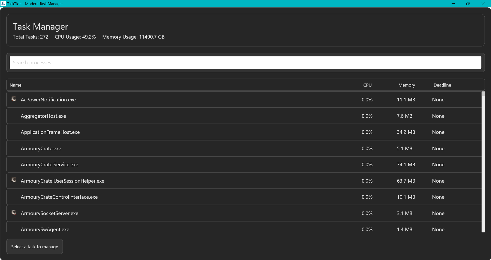
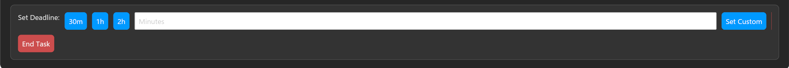

<div align="center">

# TaskTide


A modern, lightweight task management solution built with Rust

[](https://opensource.org/licenses/MIT)
[](https://www.rust-lang.org/)
[](https://www.microsoft.com/windows)

[Features](#features) • [Installation](#installation) • [Screenshots](#screenshots) • [Building](#building-from-source) • [Contributing](#contributing)

</div>

## About

TaskTide is a modern Windows task manager that prioritizes user experience and data safety. Built with Rust for optimal performance and memory safety, it offers unique features like automatic work-saving before process termination.

## Features

- 🚀 **Lightweight & Fast**: Built with Rust for optimal performance and minimal resource usage
- 💾 **Smart Save**: Automatically attempts to save work in applications before termination
- 🎯 **Process Management**: Efficient process monitoring and control
- ⏰ **Custom Deadlines**: Set custom deadlines for process termination
- 🖼️ **Modern UI**: Clean, intuitive interface built with Iced
- 🔒 **Memory Safe**: Leveraging Rust's memory safety guarantees

## Screenshots

### Main Interface

*The main interface showing the process list with system information*

### Custom Deadline Setting

*Set custom deadlines for process termination with the intuitive timer interface*


## Installation

### Automatic Installation (Recommended)
1. Download the latest installer from the [Releases](../../releases/latest) page
2. Run `TaskTide-Setup.ps1` with PowerShell
3. Follow the installation prompts

### Portable Version
1. Download the latest portable version from the [Releases](../../releases/latest) page
2. Extract `TaskTide-v1.3.zip` to your preferred location
3. Run `tasktide.exe`

> Note: If Windows SmartScreen appears, click "More info" and then "Run anyway". This happens because the application is new and not yet widely distributed.

## Building from Source

Prerequisites:
- Rust toolchain (rustc, cargo)
- Windows 10 or later

```bash
# Clone the repository
git clone https://github.com/yourusername/tasktide.git

# Navigate to the project directory
cd tasktide

# Build the release version
cargo build --release

# The executable will be in target/release/tasktide.exe
```

## System Requirements

- Windows 10 or later
- 64-bit processor
- 50MB disk space
- No additional runtime requirements
- Rust is NOT required to run the application (only needed for building from source)

## Contributing

Contributions are welcome! Please feel free to submit a Pull Request. For major changes, please open an issue first to discuss what you would like to change.

1. Fork the Project
2. Create your Feature Branch (`git checkout -b feature/AmazingFeature`)
3. Commit your Changes (`git commit -m 'Add some AmazingFeature'`)
4. Push to the Branch (`git push origin feature/AmazingFeature`)
5. Open a Pull Request

## Future Scope

TaskTide is evolving, and we have exciting plans for future versions:

### Cross-Platform Support
- 🐧 **Linux Support**: Development of a Linux version is planned
- 🌐 **Cross-Platform Compatibility**: Unified experience across Windows and Linux
- 🔄 **Shared Configuration**: Seamless settings sync between platforms

### Kernel Integration
- 🔐 **Kernel-Level Process Management**: Direct kernel integration for enhanced control
- ⚡ **Performance Optimization**: Reduced overhead through kernel-level operations
- 🛡️ **Advanced Process Protection**: Kernel-level security features

### Enhanced Features
- 🎨 **Custom Themes**: User-defined color schemes and layouts
- 📊 **Advanced Analytics**: Detailed process behavior analysis
- 🔍 **Smart Process Detection**: AI-powered process categorization
- 💾 **Extended Save Support**: More applications and save patterns
- 🔄 **Process Dependencies**: Visual process dependency mapping
- ⏰ **Scheduled Actions**: Automated process management

### Architecture Improvements
- 🏗️ **Modular Design**: Plugin system for extended functionality
- 🔌 **API Integration**: REST API for remote management
- 📦 **Container Support**: Docker and container process management
- 🔧 **Custom Rules Engine**: User-defined process management rules

### Community Features
- 🌍 **Localization**: Support for multiple languages
- 🤝 **Rule Sharing**: Community-shared process management rules
- 📚 **Extended Documentation**: Comprehensive guides and API docs

Want to contribute to these features? Check our [Contributing](#contributing) section!

## License

This project is licensed under the MIT License - see the [LICENSE](LICENSE) file for details.

## Acknowledgments

- Built with [Rust](https://www.rust-lang.org/)
- UI powered by [Iced](https://github.com/iced-rs/iced)
- System information by [sysinfo](https://github.com/GuillaumeGomez/sysinfo)
